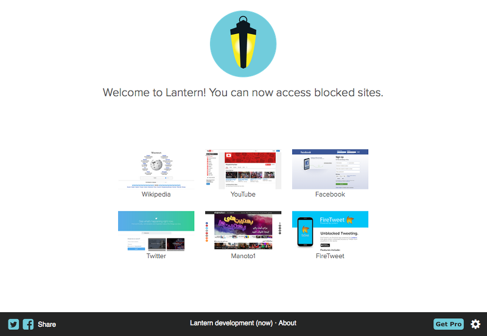
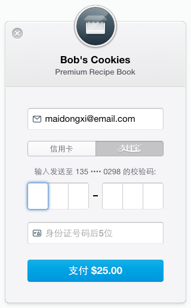
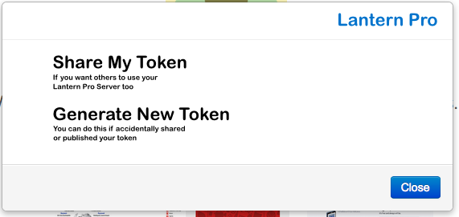

# LEP 012 - Pro version, personal server

Date: September 9th, 2015

Status: Draft

Author: uaalto

## Abstract

A proposal for a Lantern Pro version consisting of a premium personal server, automatically launched after payment has been processed.  The launched server and the requesting client are automatically configured.  Eventually, these personal servers should be shareable at will by the user to other Lantern instances or users.

## Rationale

This LEP stems from the need to accomodate more users within reasonable costs, focusing in one of the different solutions to the problem: diverting users to personal customer-supported servers.  The servers could be shared by more than one user, as long as the user agrees and takes an active decision to do so.  This sharing should be easy in order to facilitate the mechanism and encourage diverse growth approaches for Lantern.


## Proposal

### 1. Payment UI

The process of requesting a personal server should be initiated from the Lantern UI.  This sketch proposes a simple way of including it in current Lantern interface.  This can be revisited from the UX/UI perspective, but it serves as a solid starting point.

<p align="center">

</p>

The *Get Pro* button would open a menu with playment solutions and plans.  If the option explained below of using configuration files distributed via email to the users who purchase Pro is chosen, this would be a good place for the file selector.

Since June 2014, Stripe can accept Alipay payments, which opens the door to offering this service in China.  Using Alipay with Stripe is straightforward, and just requires an option in the HTML5 data fields.  The default UI is as follows:

<p align="center">

</p>

The simplest UI seems to be most effective, reducing complexities and legal issues related to saving the user data and payment information.  Stripe handles that and takes care of PCI compliance and security, as it keeps everything off Lantern's servers.  Most importantly, Stripe has done a great job at UX/UI and optimizing conversion rates with their UI widget.

This UI widget will be responsible of sending a request to Stripe/Alipay.  This is the code template that the UI will require (just HTML5), so the code is minimally invasive to current Lantern UI:

```
<form action="" method="POST">
  <script
    src="https://checkout.stripe.com/checkout.js" class="stripe-button"
    data-key="pk_test_6pRNASCoBOKtIshFeQd4XMUh"
    data-amount="2000"
    data-name="Demo Site"
    data-description="2 widgets ($20.00)"
    data-image="/128x128.png"
    data-locale="auto">
  </script>
</form>
```


### 2. Payment processing

The payment process involves the Lanter Client, the Stripe Servers and the Lantern Server.  The proposed workflow is summarized in the following picture:

<p align="center">

</p>

The example code shown in the previous section will not execute the charge from the Lantern client UI, but rather send a request to validate the data in Stripe **(step 1)**.  Stripe's JavaScript plugin (called *Checkout*) hijacks the form in order to do this before contacting any of our servers.  Stripe will reply to the AJAX request with a one-time token, which will be inserted into the form **(step 2)**.  Finally, the form is sent by the Lantern UI in a POST request (done via an async callback triggered by the successful AJAX reply from Stripe) to a web service in the Lantern cloud (*the Payments server*), along the token and the validated data **(step 3)**.

This request needs to carry also some data to identify the Lantern instance (lantern id and IP).  For this, we can use Stripe request [metadata](https://stripe.com/docs/api#metadata).  Ideally, this will also provide geolocation and/or IP information.  The geolocation data will be useful for deciding in which DC to launch the proxy.


#### Payments Server receives confirmation

Once all validation has be done at Stripe's side, the UI Javascript side will receive a one-time token that will then be sent to the Lantern's Payments server so it can proceed with charging.

**Important Note: Ideally, the user shouldn't be required to contact Lantern's Payments server.  Unfortunately there is currently no way to perform charges from the client, nor add a webhook at the validation stage.**

At this point, the charge has been done and we can proceed with launching a server.  Stripe's charging API is *synchronous*, so if it succeeds we can act immediately, whithout requiring any callback to check status. As soon as the `charge` call returns, we are good to go **(step 4)**.  This will be done by appending a new Lantern Pro Server request in Redis DB.

**Notes on optional features**

Should card details be saved? We don't have users at the moment, and since we are working with tokens, it is probably best to keep it simple without users.  Additionally, it seems that Alipay users are more confortable with one-time payments than subscriptions, even if for larger periods.  Although they are separate things, the fact that users don't like subscriptions suggests that is better to just provide a very simple UI and no information saving or accounts.


### 3. Providing a private Pro Server to the client

#### Redis Pro Servers queue and management

If the payment was successful, the charge has been registered and we can safely launch the server and provide the server and the client with the necessary information for secure proxying.  Thus, the Lantern Payments Server needs to append a new server request in a queue in Redis **(step 5 - a)**.  This will allow *Cloudmaster* to pick up this job and execute the requests in the best datacenter for the Lantern client.  The Redis DB is effectivelly serving as a message queue between the Payments Server and the Cloudmaster, just as what happens with the Config Server and Cloudmaster for the free service.

Cloudmaster will need to run new tasks.  These are inevitable:

1. Watch for new Pro Servers requests, and launch as necessary.  This is currently done for free LCSs, so it could extend the functionality or be based on it.

1. Check private proxy remaining time of service, and shut down those that surpassed a certain time threshold.  Similar to what retiring servers is doing at the moment, but triggered by a time event.

#### Automatically configuring the client and server pairing

There is some information that needs to be placed at the newly launched server, and some shared among the client and server.  We will need:

* The access token (in both the client and server)

* The server certificate (in both the client and server)

* The server static IP (in the client)

First, the server should be automatically configured with this information by the Cloudmaster.  It also needs to notify the Payments Server, confirming successfull launch of the server and providing it with the information for the user.  Once this confirmation is received by the Payments Server, it will push a message to the Lantern client (via HTTP long polling or a websockets connection) **(step 5 - b)**.  At this point the Payments Server's mission is finished.

When the Lantern client gets all the information it requires to pair with the server, it can proceed to override config.  It is suggested that the regular free Lantern config is left as a fallback, in case there is an issue with the Pro Server, giving time to the Lantern team to investigate.

**Alternative method for config distribution to the client**

There are two disadvantages to the proposed method:

* It creates a differentiated method for purchasing Pro for one Lantern instance and several.  In other words, if you want to share the token, you inevitably need to introduce a different step for configuration.

* It doesn't take into account the time taken to spawn a new server until it becomes functional.  If it's too long, a notification system should be put in place, instead of a simple push/long-poll that seems to assume that the user will be in front of the UI waiting for the setup to be finished.  A proper waiting UI could be a solution for this, though.

An email-based Pro Server config file is proposed for this.  The file can be directly shared to other Lantern instances or users and the sharing problem would be solved.  The cost of this solution is obvious: it introduces a more manual setup.  It is suggested however that the advantages outweight the disadvantages.

The UI for this would be a file selector in the *Get Pro* menu, that the user can employ to open the file sent by Lantern.


## Sharing across devices and users

These are some less critical but relevant options suggested for *Lantern Pro*:

* Share token (share the Lantern Pro Server with other instances of Lantern or users).

* Regenerate token (for security reasons, in case of unwanted share)

The following is a crude approximation of how the UI could look like is:

<p align="center">

</p>

If the alternate path for config distribution to clients is chosen, the *share token* option becomes irrelevant.

The details on the implementation of these extensions are left for a second pass, once the core part of the project is in place and the details are figured out.  Probably users will tell if these are actually desired features or just cruft.


## Conclusion

These are some open questions for possible future improvements:

* Could we use the Pro servers for users when they are not connected?

* Should we put an alarms system in place if we detect that a proxy could be used by a malicious user that could have stolen the key?
