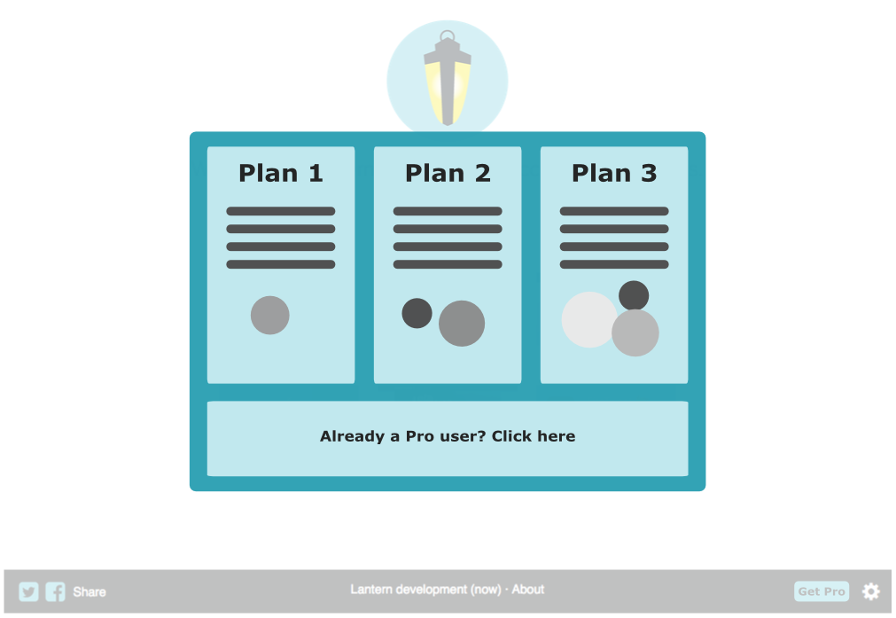
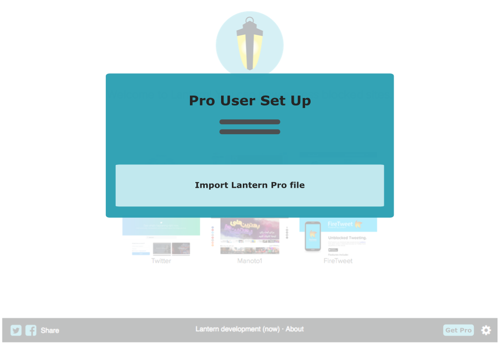
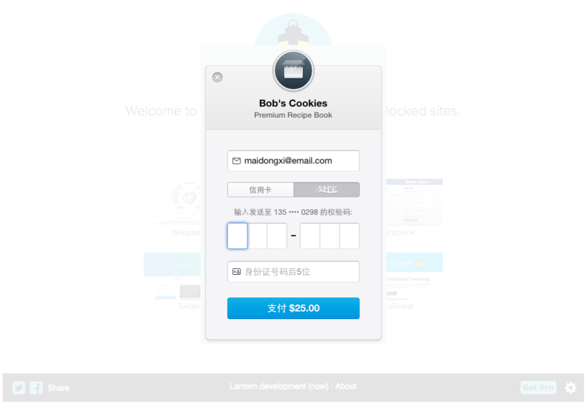
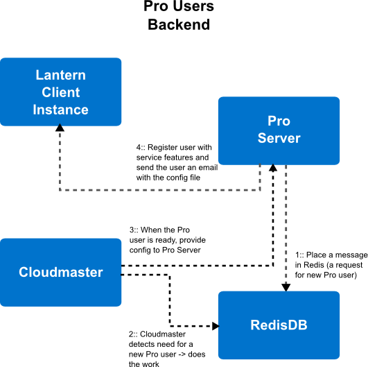

# LEP 012 - Pro version, personal server

Date: September 9th, 2015

Status: Draft

Author: uaalto

## Abstract

A proposal for a Lantern Pro version consisting of a premium personal server, automatically launched after payment has been processed.  The launched server and the requesting client are automatically configured.  Additionally, these personal servers should be shareable at will by the user to other Lantern instances or users.

## Rationale

This LEP stems from the need to accomodate more users within reasonable costs, focusing in one of the different solutions to the problem: diverting users to personal customer-supported servers.  The servers could be shared by more than one user, as long as the user agrees and takes an active decision to do so.  This sharing should be easy in order to facilitate the mechanism and encourage diverse growth approaches for Lantern.


## Proposal

### 1. Payment UI

#### 1.1 The process of requesting a personal server should be initiated from the Lantern UI.

This sketch proposes a simple way of including it in current Lantern interface.  This can be revisited from the UX/UI perspective, but it serves as a starting point.

<p align="center">

</p>

#### 1.2 The *Get Pro* button would open a menu with playment solutions and plans.

In this screen, we should offer also the possibility to the user to recover a Pro configuration, since he/she can be setting up Lantern in a different device or just reinstalling the program.

<p align="center">

</p>

#### 1.3 The user clicks "Already Pro User"

This screen should be the same one the **Lantern Pro notification email** points to (see below).  It allows the user to open the file that has his/her custom Pro server config.

<p align="center">

</p>

#### 1.4 The user clicks a Payment plan

When a user clicks a plan, the payment gateway pops up.  This process needs to be integrated and seamless.  Among the different options Stripe stands out for its integration, UI/UX and access in relevant countries.

<p align="center">

</p>

Since June 2014, Stripe can accept Alipay payments, which opens the door to offering this service in China.  Using Alipay with Stripe is straightforward, and just requires an option in the HTML5 data fields.  The default UI is as follows:

<p align="center">

</p>

The simplest UI seems to be most effective, reducing complexities and legal issues related to saving the user data and payment information.  Stripe handles that and takes care of PCI compliance and security, as it keeps everything off Lantern's servers.  Most importantly, Stripe has done a great job at UX/UI and optimizing conversion rates with their UI widget.

This UI widget will be responsible of sending a request to Stripe/Alipay.  This is the code template that the UI will require (just HTML5), so the code is minimally invasive to current Lantern UI:

```
<form action="" method="POST">
  <script
    src="https://checkout.stripe.com/checkout.js" class="stripe-button"
    data-key="pk_test_6pRNASCoBOKtIshFeQd4XMUh"
    data-amount="2000"
    data-name="Demo Site"
    data-description="2 widgets ($20.00)"
    data-image="/128x128.png"
    data-locale="auto">
  </script>
</form>
```


### 2. Payment processing

The payment process involves the Lanter Client, the Stripe Servers and the Lantern Server.  The Stripe workflow is summarized in the following picture:

<p align="center">

</p>

The example code shown in the previous section will not execute the charge from the Lantern client UI, but rather send a request to validate the data in Stripe **(step 1)**.  Stripe's JavaScript plugin (called *Checkout*) hijacks the form in order to do this before contacting any of our servers.  Stripe will reply to the AJAX request with a one-time token, which will be inserted into the form **(step 2)**.  Finally, the form is sent by the Lantern UI in a POST request (done via an async callback triggered by the successful AJAX reply from Stripe) to a web service in the Lantern cloud (*the Pro server*), along the token and the validated data **(step 3)**.

This request needs to carry also some data to identify the Lantern instance (lantern id and IP).  For this, generally hidden input fields in the form are used.  Ideally, this will also provide geolocation and/or IP information.  The geolocation data will be useful for deciding in which DC to launch the proxy.


#### Pro Server receives confirmation

Once all validation has be done at Stripe's side, the UI Javascript side will receive a one-time token that will then be sent to the Lantern's Pro server so it can proceed with charging.

**Important Note: Ideally, the user shouldn't be required to contact Lantern's Pro server.  Unfortunately there is currently no way to perform charges from the client, nor add a webhook at the validation stage.**

At this point, the charge has been done and we can proceed with launching a server.  Stripe's charging API is *synchronous*, so if it succeeds we can act immediately, whithout requiring any callback to check status. As soon as the `charge` call returns, we are good to go **(step 4)**.  This will be done by appending a new Lantern Pro Server request in Redis DB.

**A note on information storage**

Should card details be saved? We don't have users at the moment, and since we are working with tokens, it is probably best to keep it simple without users.  Additionally, it seems that Alipay users are more confortable with one-time payments than subscriptions, even if for larger periods.  Although they are separate things, the fact that users don't like subscriptions suggests that is better to just provide a very simple UI and no information saving or accounts.


### 3. Providing a private Pro Server to the client

#### Overview of Lantern Pro cloud backend

For our purposes, we will ultimately need to handle Pro servers, launch them and pair them with users.  We might want several Pro users in one server, or even a user in two or more servers.  This is the general architecture that will allow flexibility for these options, based on the current approach used by the regular Lantern service.

<p align="center">

</p>

#### Redis Pro Servers queue and management

If the payment was successful, the charge has been registered and we can safely launch the server and provide the server and the client with the necessary information for secure proxying.  Thus, the Lantern Pro Server needs to append a new server request in a queue in Redis **(step 1)**.  This will allow *Cloudmaster* to pick up this job and execute the requests in the best datacenter for the Lantern client **(step 2)**.  The Redis DB is effectivelly serving as a message queue between the Pro Server and the Cloudmaster, just as what happens with the Config Server and Cloudmaster for the regular service.  Cloudmaster will need watch for new Pro Servers requests, and launch as necessary.  This is currently done for regular LCSs, so it could extend the functionality or be based on it.

#### Automatically configuring the client and server pairing

There is some information that needs to be placed at the newly launched server, and some shared among the client and server.  We will need:

* The access token (in both the client and server)
* The server certificate (in both the client and server)
* The server static IP (in the client)

First, the server should be automatically configured with this information by the Cloudmaster.  It then needs to notify the Pro Server **(step 3)**, confirming successfull launch of the server and providing it with the information for the user.  Once this confirmation is received by the Pro Server, it will register the user service, and send an email to the user with the config file **(step 4)**.

The *file-in-email* solution is proposed in order to avoid these potential issues:

* The  differentiated method for purchasing Pro for one Lantern instance and several.  In other words, if you want to share the token, you inevitably need to introduce a different step for configuration.  The file can be directly shared to other Lantern instances or users and the sharing problem would be solved.  This email will contain also a direct link to the local UI to easily open the file attached and make the configuration automatic.

* The time taken to spawn a new server until it becomes functional.  It's more robust to decouple the UI from the events in the Lantern Cloud.


When the Lantern client gets all the information it requires to pair with the server, it can proceed to override config.  It is suggested that the regular free Lantern config is left as a fallback, in case there is an issue with the Pro Server, giving time to the Lantern team to investigate.


## Sharing across devices and users

These are some less critical but relevant options suggested for *Lantern Pro*:

* Share token (share the Lantern Pro Server with other instances of Lantern or users).

* Regenerate token (for security reasons, in case of unwanted share)

The following is a crude approximation of how the UI could look like:

<p align="center">

</p>


## Conclusion

These are some open questions for possible future improvements:

* Could we use the Pro servers for users when they are not connected?

* Should we put an alarms system in place if we detect that a proxy could be used by a malicious user that could have stolen the key?
